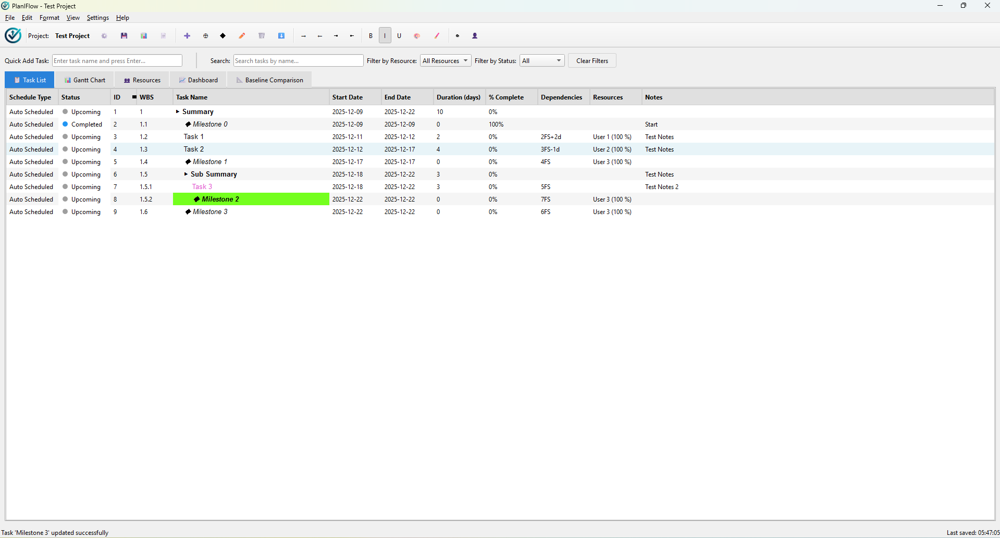
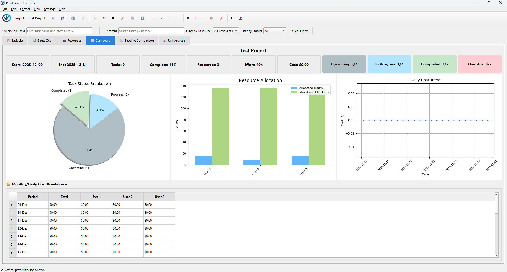
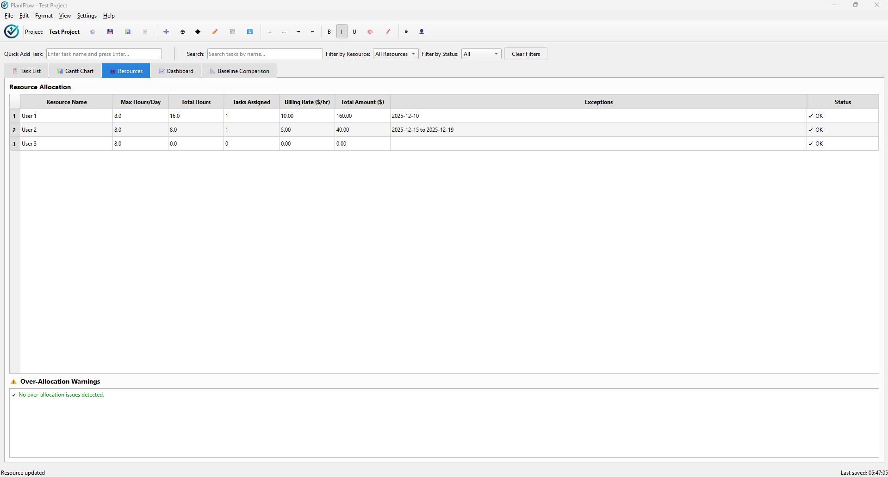

# 📊 PlanIFlow - Project Planner


PlanIFlow is a fully offline, standalone desktop application for project planning and management, offering features similar to Microsoft Project.

## 📝 Table of Contents

- [Features](#-features)
- [Technologies Used](#️-technologies-used)
- [Architecture Overview](#-architecture-overview)
- [Getting Started](#-getting-started)
  - [Prerequisites](#prerequisites)
  - [Installation](#installation)
  - [Running the Application](#running-the-application)
- [Usage](#-usage)
  - [Creating a New Project](#creating-a-new-project)
  - [Adding Tasks and Resources](#adding-tasks-and-resources)
  - [Managing Tasks](#managing-tasks)
  - [Gantt Chart](#gantt-chart)
  - [Dashboard](#dashboard)
  - [Importing and Exporting Data](#importing-and-exporting-data)
  - [Project Baselining](#project-baselining)
  - [Monte Carlo Risk Analysis](#-monte-carlo-risk-analysis)
- [Screnshots](#screenshots)
- [Shortcuts](#️-shortcuts)
- [Batch Scripts](#-batch-scripts)
- [Building from Source](#️-building-from-source)
- [License](#-license)
- [Project Structure](#-project-structure)
- [Troubleshooting](#-troubleshooting)
- [Security and Distribution](#-security-and-distribution)
- 	[Reasons for False Positve Detections](#-security-and-distribution)
- [Acknowledgments](#-acknowledgments)

## ✨ Features

- **Modular UI Architecture**: A well-organized and extensible user interface, making it easier to navigate and manage project elements.
- **Project Settings Management**: Dedicated interface for configuring project-specific settings and preferences.
- **Task Management**: Create, edit, delete tasks with dependencies
- **Hierarchical Tasks**: Create summary tasks and sub-tasks.
- **Inline Editing**: Directly edit task properties within the table for quick modifications.
- **Context Menus**: Right-click on tasks for quick access to actions like edit, delete, indent, and outdent.
- **Task Filtering**: Search and filter by resource, status, or name
- **Calendar Management**: Custom work hours
- **Resource Management**: Allocate resources, track utilization, and manage billing rates.
- **Resource Allocation Tracking**: Detect over-allocation
- **Resource Exception**: Resources can now have exception days (holidays/leaves) that exclude them from work on specific dates. This affects their billing and effort calculations.
- **Total Project Cost in Dashboard**: The dashboard now displays the total estimated cost of the project, calculated from all assigned resources and their billing rates.
- **Project Baselining**: Create up to 3 project baselines to capture snapshots of your project at specific points in time. Compare current progress against baselines to track variances in start dates, end dates, duration, and completion percentages. Baselines are fully integrated with Excel and JSON import/export.
- **Monte Carlo Risk Analysis**: A risk assessment tool that simulates the project schedule hundreds or thousands of times to generate a probability distribution of possible project completion dates.
- **Rich Text Task Formatting**: Customize the appearance of tasks with rich text formatting options. Make important tasks stand out or organize your project visually.
    - **Font Styling**: Apply **bold**, *italic*, and underline to task names.
    - **Coloring**: Change the font color and background color of tasks.
    - **Font Selection**: Choose from a variety of font families and sizes.
- **Duration Unit Selection**: Switch between 'Days' and 'Hours' for task duration calculations, allowing for more granular project planning.
- **Dynamic Gantt Charts**: Real-time visualization with dependencies
- **Project Dashboard**: Overview of project metrics, including total project cost.
- **Excel Import/Export**: Share plans via Excel files
- **JSON Import/Export**: Save and load projects in JSON format.
- **PDF Import/Export**: Save and load projects in PDF format.
- **Undo/Redo**: Full history support for task creation, deletion, editing, movement, and resource management.
- **Zoom Controls**: Zoom in and out of the Gantt chart for better visualization.
- **Dark Mode**: Toggle between light and dark themes

## 🛠️ Technologies Used

- Python
- PyQt6
- Pandas
- Matplotlib
- Openpyxl
- Reportlab
- Numpy
- Pillow

## Architecture Overview

The application follows a modular architecture, separating data management, UI, and business logic into distinct components. This design makes the application easier to maintain and extend.

## 🚀 Getting Started

### Prerequisites

- Windows Operating System
- Python 3.11 or higher

### Running the Application

#### Windows:

Once the installation is complete, you can run the application by executing the `run.bat` script. This script will activate the virtual environment and start the application.

```bash
run.bat
```

or 

Use the `build.bat` script to generate an `PlayIFlow 2.2.0.exe` file which will be saved at `dist/` folder.

```bash
build.bat
```

#### Linux/Mac

To run this application on Linux or macOS, follow these steps:
1. Open your terminal.

2. Create a virtual environment: 
```bash
python3 -m venv venv
```

3. Activate the virtual environment: 
```bash
source venv/bin/activate
```

4. Install dependencies: 
```bash
pip install -r requirements.txt
```

5. Run the application: 
```bash
python3 main.py 
```

### Using Standalone Executables

#### Windows (.exe)
Download PlanIFlow `PlanIFlow_2.2.0.zip`:
Download Code Verification Certificate: [Dipta Roy - Code Verification Certificate](https://github.com/dipta-roy/dipta-roy.github.io/blob/main/downloads/Code%20Verifying%20Certificates.zip).
```
- HOW TO TRUST

1. Unzip the distribution package.
2. Double-click: Signed_By_Dipta_CodeSigningPublicKey.cer
3. Click: "Open" -> "Install Certificate..."
4. Select: "Current User"
5. Choose: "Place all certificates in the following store"
6. Browse -> "Trusted People" -> OK -> Next -> Finish

- VERIFY APPLICATION AUTHENTICITY

1. To confirm the application is genuine, open its Properties.
2. Go to the Digital Signatures tab.
3. Select "Signed_By_Dipta" from the Embedded Signatures list, then choose Details.
4. In the General tab, you should see the message "This digital signature is OK." which confirms the app was signed by Dipta using the listed certificates.
```

Once verified,
```
Run PlanIFlow_2.2.0.exe and install the application.
```

## 💻 Usage

### Creating a New Project

- Go to `File > New Project` to start a new project.
- You can name your project by going to `File > Rename Project`.

### Adding Tasks and Resources

- **Add Resources**: Click the `👤 Add Resource` button in the toolbar to add resources like team members or equipment. You can now also specify a billing rate for each resource.
- **Add Tasks**: Click the `➕ Add Task` button to create a new task. You can set the start and end dates, assign resources, and add notes.
- **Sub-tasks**: Select a task and click `➕ Add Subtask` to create a child task.

### Managing Tasks

- **Inline Editing**: Double-click on a task field (e.g., Task Name, Start Date, End Date, Duration, % Complete, Dependencies, Resources, Notes) to directly edit its value. Press `Enter` to save changes or `Esc` to cancel.
  - **Date Fields**: Use the calendar dropdown for Start Date and End Date.
  - **Resources Field**: Select from a dropdown of existing resources or type new ones.
  - **Status and ID**: These fields are automatically populated and cannot be edited directly.
- **Context Menu**: Right-click on any task row to bring up a context menu with options such as editing the task, deleting it, indenting, or outdenting.
- **Indent/Outdent**: Use the `Tab` and `Shift+Tab` keys to indent and outdent tasks, creating a task hierarchy.

### Resource Exception Days

- **Single Day**: A specific date when the resource is unavailable
- **Date Range**: A continuous period when the resource is unavailable (e.g., vacation)

### Gantt Chart

The **Gantt Chart** tab provides a visual representation of your project timeline. Dependency lines are drawn between tasks, and the chart is updated in real-time.
- **Show Critical Path**: Check the checkbox → red highlights for zero-slack tasks.

### Dashboard

The **Dashboard** tab gives you a high-level overview of your project, including:

-   Project start and end dates
-   Total number of tasks
-   Overall project completion percentage
-   Task status breakdown
-   **Total Project Cost**: A summary of the estimated cost across all resources.
- 	Scroll for Budget and cost tables.

### Importing and Exporting Data

- **JSON**: Save and load your projects using the `.json` format. This is the recommended format for saving your work.
- **Excel**: Import and export your projects to and from Excel files. This is useful for sharing your project with others who may not have the application.
- **PDF**: Export your projects to and from PDF report.

### Project Baselining

Baselines allow you to capture snapshots of your project at key milestones and compare current progress against them.

- **Creating a Baseline**:
  - Go to `Settings > Baselines > Set Baseline...`
  - Click "Create New Baseline" and enter a name (e.g., "Initial Plan", "Q1 Baseline")
  - The baseline captures all task start dates, end dates, durations, and completion percentages
  - You can create up to 3 baselines per project

- **Viewing Baseline Comparison**:
  - Go to `Settings > Baselines > View Baseline Comparison` or click the "📊 Baseline Comparison" tab
  - Select a baseline from the dropdown to compare against current project state
  - View detailed variance analysis including:
    - Start/End date variances (in days)
    - Duration variances
    - Completion percentage variances
    - Color-coded status indicators (late=red, early=green, on-track=blue)
  - Summary statistics show overall project health

- **Managing Baselines**:
  - Rename baselines to reflect project phases
  - Delete outdated baselines
  - Baselines are automatically saved with your project in JSON and Excel formats
  - When importing projects, baselines are restored with full backward compatibility

## 🎲 Monte Carlo Risk Analysis

The Monte Carlo analysis feature provides a powerful way to forecast project completion dates under uncertainty. Instead of relying on a single, deterministic schedule, it runs thousands of simulations to model a range of possible outcomes.

- **How to Use**:
  - Go to the `Risk Analysis` tab.
  - Set the number of **Iterations** (e.g., 1000). More iterations lead to more accurate statistical results but take longer to run.
  - Click **"Run Analysis"**.

- **Interpreting the Results**:
  - **Confidence Table**: This table shows the predicted completion dates for different confidence levels:
    - **P50 (Median)**: The date by which there is a 50% chance of completion. This is the most likely outcome.
    - **P80 (Low Risk)**: The date you can be 80% confident the project will be finished. A good target for stakeholder communication.
    - **P90 (High Confidence)**: A very conservative date with a 90% chance of completion.
  - **Top Risk Drivers**: This is a ranked list of tasks that most frequently appear on the critical path during the simulations. These are the tasks that have the biggest impact on your project's schedule. Focus on managing these tasks to reduce schedule risk.
  - **Completion Date Distribution**: An ASCII histogram that visualizes the spread of possible completion dates, giving you a quick overview of the project's risk profile.

## Screenshots

| Task List | Edit Task |
| --- | --- |
|  |  |

| Gantt Chart | Gantt Chart With Critical Path |
| --- | --- |
|  |  |

| Dashboard | Resource |
| --- | --- |
|  |  |

| Project Baseline | Risk Analysis |
| --- | --- |
|  |  |

| Project Settings | |
| --- | --- |
|  | |

## ⌨️ Shortcuts

| Shortcut         | Action                  |
| ---------------- | ----------------------- |
| `Ctrl+T`         | Add Task                |
| `Ctrl+M`         | Add Milestone		     |
| `Ctrl+Shift+T`   | Add Subtask             |
| `Ctrl+N`         | New Project             |
| `Ctrl+O`         | Open Project            |
| `Ctrl+S`         | Save Project            |
| `F5`             | Refresh All             |
| `Tab`            | Indent Task             |
| `Shift+Tab`      | Outdent Task            |
| `Space`          | Toggle Expand/Collapse  |
| `+`              | Expand Selected         |
| `-`              | Collapse Selected       |
| `Ctrl+B`         | Bold Selected       	 |
| `Ctrl+I`         | Italics Selected        |
| `Ctrl+U`         | Underline Selected      |
| `Ctrl+Z`         | Undo                    |
| `Ctrl+Y`         | Redo                    |
| `Ctrl++`         | Zoom In (Gantt)         |
| `Ctrl+-`         | Zoom Out (Gantt)        |

## 🪟 Batch Scripts

This project includes a set of batch scripts to automate common tasks on Windows:

| Script              | Purpose                                                                        |
| ------------------- | ------------------------------------------------------------------------------ |
| `run.bat`           | Runs the application, creating a virtual environment and installing dependencies if needed. |
| `build.bat`         | Builds a standalone `.exe` file of the application.                            |
| `clean.bat`         | Cleans up the project directory by removing build artifacts and cache files.   |

## 🛠️ Building from Source

To build a standalone executable from the source code, you can use the `build.bat` scripts.

-   **`build.bat`**: Creates a single `.exe` file in the `dist` folder. This is the easiest way to create a distributable version of the application.

## 📂 Project Structure

| Path                                     | Description                                                                                             |
| ---------------------------------------- | ------------------------------------------------------------------------------------------------------- |
| `main.py`                                | Main entry point of the application.                                                                    |
| `build.bat`, `clean.bat`, `run.bat`      | Batch scripts for building, cleaning, and running the application on Windows.                           |
| `prepare_spec.py`                        | Script to prepare the PyInstaller spec file for building the executable.                                |
| `requirements.txt`                       | A list of Python packages required to run the application.                                              |
| `calendar_manager/calendar_manager.py`   | Manages project calendars, including working days, holidays, and custom work schedules.                 |
| `command_manager/command_manager.py`     | Manages the undo/redo stack and executes commands.                                                      |
| `command_manager/commands.py`            | Defines individual command classes (Add, Edit, Delete, Move) for undoable actions.                      |
| `constants/app_images.py`                | Contains Base64 encoded application images and icons.                                                   |
| `constants/constants.py`                 | Defines global constants and configuration values.                                                      |
| `data_manager/models.py`                 | Defines data models for tasks, resources, and other project entities.                                   |
| `data_manager/manager.py`                | The core data manager, handling tasks, resources, critical path, and cost management.                   |
| `data_manager/baseline.py`               | Defines baseline data models for capturing project snapshots.                                           |
| `data_manager/monte_carlo.py`            | Handles Monte Carlo simulation for risk analysis.                                                       |
| `exporter/exporter.py`                   | Handles the import and export of project data in formats like JSON and Excel.                           |
| `exporter/pdf_exporter.py`               | Responsible for exporting project reports and Gantt charts to PDF format.                               |
| `settings_manager/settings_manager.py`   | Manages application settings, such as duration units and theme preferences.                             |
| `ui/ui_main.py`                          | The main window of the application, containing tabs, menus, and the primary tree view.                  |
| `ui/ui_tasks.py`                         | Implements the task tree view, handling task hierarchy and dependencies.                                |
| `ui/ui_resources.py`                     | Implements the resource table, displaying resource allocation and warnings.                             |
| `ui/gantt_chart.py`                      | Implements the dynamic Gantt chart visualization.                                                       |
| `ui/ui_dashboard.py`                     | Creates the project dashboard interface.                                                                |
| `ui/ui_delegates.py`                     | Contains custom delegates for UI editors, such as date pickers and resource selectors.                  |
| `ui/ui_baseline_comparison.py`           | Implements the baseline comparison tab for variance analysis.                                           |
| `ui/ui_baseline_manager.py`              | Manages baseline-related operations and interactions.                                                   |
| `ui/ui_baseline_dialog.py`               | Defines the dialog for managing project baselines.                                                      |
| `ui/ui_calendar_settings_dialog.py`      | Defines the dialog for configuring project calendar settings.                                           |
| `ui/ui_duration_unit_dialog.py`          | Defines the dialog for setting duration units (e.g., days, hours).                                      |
| `ui/ui_file_manager.py`                  | Manages file-related operations within the UI.                                                          |
| `ui/ui_formatting.py`                    | Implements the font and color formatting features.                                                      |
| `ui/ui_helpers.py`                       | Provides utility functions and helper methods for UI-related tasks.                                     |
| `ui/ui_menu_toolbar.py`                  | Handles actions and shortcuts for the application's menu and toolbar.                                   |
| `ui/ui_monte_carlo.py`                   | Implements the Monte Carlo simulation tab.                                                              |
| `ui/ui_project_settings.py`              | Defines the dialog for configuring general project settings.                                            |
| `ui/ui_resource_dialog.py`               | Defines the dialog for managing and editing resources.                                                  |
| `ui/ui_resource_exceptions_widget.py`    | Widget for managing resource exceptions (holidays/leaves).                                              |
| `ui/ui_task_dialog.py`                   | Defines the dialog for managing and editing individual tasks.                                           |
| `ui/ui_task_manager.py`                  | Manages task-related operations and interactions within the UI.                                         |
| `ui/ui_tree_view_manager.py`             | Manages the overall behavior and interactions of the tree view widgets.                                 |
| `ui/ui_view_manager.py`                  | Manages the different views and their transitions within the application.                               |
| `ui/themes.py`                           | Manages the application's visual themes (e.g., light and dark mode).                                    |

**Note:** The `build` and `dist` directories are generated during the build process and contain the compiled application and its dependencies. 

## 🐛 Troubleshooting

-   **Resource Files Not Found (PyInstaller builds)**: If you encounter issues with the application not finding images or other data files when running a built executable, it might be related to how PyInstaller bundles resources. The application uses `sys._MEIPASS` to locate files in standalone executables. Ensure all necessary data directories (e.g., `images`, `constants`) are correctly included in the PyInstaller build process via `--add-data` flags in `build.bat`.
-   **Application does not start**: Ensure you have Python 3.11 or higher installed and that it is in your system's PATH.
-   **`ModuleNotFoundError`**: If you get an error about a missing module, run `pip install -r requirements.txt` in the activated virtual environment.

## 📄 License

This project is licensed under the MIT License. See the [LICENSE](LICENSE) file for more details.

## 📈 Security and Distribution

- **Security Assessment**: [Full Report](https://github.com/dipta-roy/PlanIFlow/blob/main/SECURITY.md) – **Low Risk** (offline, safe I/O).
- **Distribution**: Use signed builds; include .cer for trust.
- **VirusTotal Report**: [VirusTotal Report](https://www.virustotal.com/gui/file/658d22127727cd9675d037479010c91bd6f8b2be11df235e1f2f2f9aec831d7f) - May detect as **false positive**, add to Exclusion if necessary.

### Reasons for False Positve Detections:
- **PyInstaller Bundling**: Embeds Python runtime, bytecode, and large libraries (e.g., PyQt6, matplotlib) into a single EXE, mimicking packed malware droppers via temporary unpacking.
- **Dynamic Loading**: Hidden imports and runtime code execution (e.g., via exec()) trigger heuristics for code injection, similar to script-based threats.
- **Suspicious Behaviors**: File I/O, subprocess calls, and network potential (from libs like requests, which are cleaned as much possible) score as PUPs in sandboxes.
- **Generic Heuristics**: Large file size, unsigned EXE, and fuzzy hashing group it with known threats; common false positive for PyInstaller apps (85%+ cases).

## 🙏 Acknowledgments

- Icons: [Flaticon](https://flaticon.com).
- Thanks to PyQt6 & Matplotlib communities.

Built by [Dipta Roy](https://github.com/dipta-roy) with ❤️