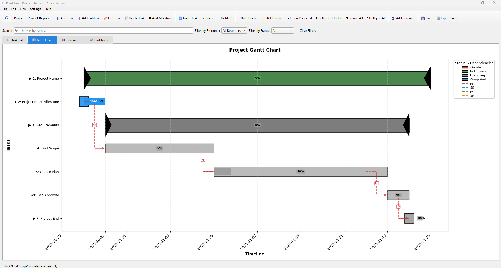
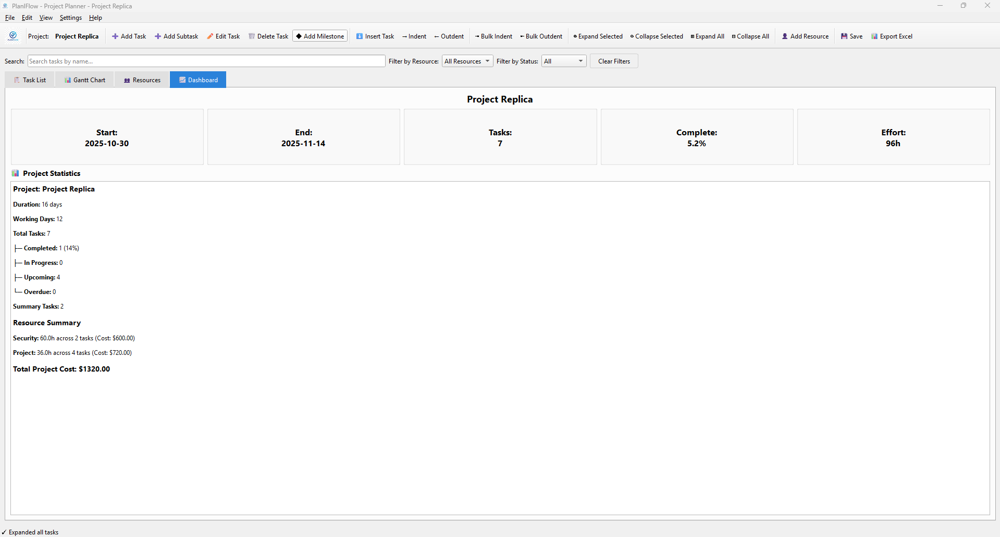

# 📊 PlanIFlow - Project Planner - Desktop Project Management Application


PlanIFlow is a fully offline, standalone desktop application for project planning and management, offering features similar to Microsoft Project.

## 📝 Table of Contents

- [Features](#-features)
- [Technologies Used](#️-technologies-used)
- [Getting Started](#-getting-started)
  - [Prerequisites](#prerequisites)
  - [Installation](#installation)
  - [Running the Application](#running-the-application)
- [Usage](#-usage)
  - [Creating a New Project](#creating-a-new-project)
  - [Adding Tasks and Resources](#adding-tasks-and-resources)
  - [Managing Tasks](#managing-tasks)
  - [Gantt Chart](#gantt-chart)
  - [Dashboard](#dashboard)
  - [Importing and Exporting Data](#importing-and-exporting-data)
- [Screenshots](#-screenshots)
- [Sample Files](#-sample-files)
- [Shortcuts](#️-shortcuts)
- [Batch Scripts](#-batch-scripts)
- [Building from Source](#️-building-from-source)
- [License](#-license)
- [Project Structure](#-project-structure)
- [Troubleshooting](#-troubleshooting)


## ✨ Features

- **Task Management**: Create, edit, delete tasks with dependencies
- **Inline Editing**: Directly edit task properties within the table for quick modifications.
- **Context Menus**: Right-click on tasks for quick access to actions like edit, delete, indent, and outdent.
- **Hierarchical Tasks**: Create summary tasks and sub-tasks.
- **Resource Management**: Allocate resources, track utilization, and manage billing rates.
- **Dynamic Gantt Charts**: Real-time visualization with dependencies
- **Excel Import/Export**: Share plans via Excel files
- **JSON Import/Export**: Save and load projects in JSON format.
- **Calendar Management**: Custom work hours and holidays
- **Dark Mode**: Toggle between light and dark themes
- **Resource Allocation Tracking**: Detect over-allocation
- **Project Dashboard**: Overview of project metrics, including total project cost.
- **Task Filtering**: Search and filter by resource, status, or name
- **Resource Billing Rate Fix**: Corrected an issue where updating resource billing rates was not properly reflected in the resource table and total amount calculations.
- **Total Project Cost in Dashboard**: The dashboard now displays the total estimated cost of the project, calculated from all assigned resources and their billing rates.

## 🛠️ Technologies Used

- Python
- PyQt6
- Pandas
- Matplotlib
- Openpyxl

## 🚀 Getting Started


### Prerequisites

- Windows Operating System
- Python 3.10 or higher

### Installation

For a quick and easy setup, simply run the `install.bat` script. This will:

1.  Check if Python is installed and in your PATH.
2.  Create a virtual environment.
3.  Install all the required dependencies from `requirements.txt`.
4.  Verify the installation.

```bash
install.bat
```

### Running the Application

Once the installation is complete, you can run the application by executing the `run.bat` script:

```bash
run.bat
```

This script will activate the virtual environment and start the application.

## 💻 Usage

### Creating a New Project

- Go to `File > New Project` to start a new project.
- You can name your project by going to `File > Rename Project`.

### Adding Tasks and Resources

- **Add Resources**: Click the `👤 Add Resource` button in the toolbar to add resources like team members or equipment. You can now also specify a billing rate for each resource.
- **Add Tasks**: Click the `➕ Add Task` button to create a new task. You can set the start and end dates, assign resources, and add notes.

### Managing Tasks

- **Sub-tasks**: Select a task and click `➕ Add Subtask` to create a child task.
- **Inline Editing**: Double-click on a task field (e.g., Task Name, Start Date, End Date, Duration, % Complete, Dependencies, Resources, Notes) to directly edit its value. Press `Enter` to save changes or `Esc` to cancel.
  - **Date Fields**: Use the calendar dropdown for Start Date and End Date.
  - **Resources Field**: Select from a dropdown of existing resources or type new ones.
  - **Status and ID**: These fields are automatically populated and cannot be edited directly.
- **Context Menu**: Right-click on any task row to bring up a context menu with options such as editing the task, deleting it, indenting, or outdenting.
- **Indent/Outdent**: Use the `Tab` and `Shift+Tab` keys to indent and outdent tasks, creating a task hierarchy.

### Gantt Chart

The **Gantt Chart** tab provides a visual representation of your project timeline. Dependency lines are drawn between tasks, and the chart is updated in real-time.

### Dashboard

The **Dashboard** tab gives you a high-level overview of your project, including:

-   Project start and end dates
-   Total number of tasks
-   Overall project completion percentage
-   Task status breakdown
-   **Total Project Cost**: A summary of the estimated cost across all resources.

### Importing and Exporting Data

- **JSON**: Save and load your projects using the `.json` format. This is the recommended format for saving your work.
- **Excel**: Import and export your projects to and from Excel files. This is useful for sharing your project with others who may not have the application.

## 📸 Screenshots

| Home Screen | Gantt Chart |
| :-------------------------------------------------: | :-------------------------------------------------: |
|  |  |

| Dashboard Screen | Resource Screen |
| :-------------------------------------------------: | :-------------------------------------------------: |
|  |  |


## 📂 Sample Files

- [Sample Project JSON](sample/sample_project.json) - A basic project example in JSON format.
- [Sample Project Excel](sample/sample_project.xlsx) - The same project exported to Excel for compatibility.

## ⌨️ Shortcuts

| Shortcut         | Action                  |
| ---------------- | ----------------------- |
| `Ctrl+T`         | Add Task                |
| `Ctrl+M`         | Add Milestone		     |
| `Ctrl+Shift+T`   | Add Subtask             |
| `Ctrl+N`         | New Project             |
| `Ctrl+O`         | Open Project            |
| `Ctrl+S`         | Save Project            |
| `F5`             | Refresh All             |
| `Tab`            | Indent Task             |
| `Shift+Tab`      | Outdent Task            |
| `Space`          | Toggle Expand/Collapse  |
| `+`              | Expand Selected         |
| `-`              | Collapse Selected       |

## 🪟 Batch Scripts

This project includes a set of batch scripts to automate common tasks on Windows:

| Script              | Purpose                                                                        |
| ------------------- | ------------------------------------------------------------------------------ |
| `install.bat`       | One-click installer for first-time users.                                      |
| `run.bat`           | Runs the application, creating a virtual environment and installing dependencies if needed. |
| `build.bat`         | Builds a standalone `.exe` file of the application.                            |
| `build-advance.bat` | Provides advanced build options, such as creating a one-folder executable.     |
| `setup.bat`         | Sets up the virtual environment and installs dependencies.                     |
| `dev.bat`           | Runs the application in development mode with console output for debugging.    |
| `clean.bat`         | Cleans up the project directory by removing build artifacts and cache files.   |
| `test.bat`          | Runs a series of tests to verify the installation and file integrity.          |
| `quick-start.bat`   | A menu-driven script to quickly run any of the other scripts.                  |

## 🛠️ Building from Source

To build a standalone executable from the source code, you can use the `build.bat` or `build-advance.bat` scripts.

-   **`build.bat`**: Creates a single `.exe` file in the `dist` folder. This is the easiest way to create a distributable version of the application.
-   **`build-advance.bat`**: Provides more control over the build process, allowing you to create a one-folder build or a debug build.

## 📄 License

This project is licensed under the MIT License. See the [LICENSE](LICENSE) file for more details.

## 📂 Project Structure

```
ProjectPlanner\
├───run.bat ⭐ Quick run
├───build.bat ⭐ Build to EXE
├───install.bat ⭐ One-click installer
├───setup.bat 📦 Environment setup only
├───dev.bat 🔧 Development mode
├───clean.bat 🗑️ Clean build artifacts
├───test.bat ✅ Test installation
├───build-advanced.bat ⚙️ Advanced build options
├───calendar_manager.py
├───data_manager.py
├───exporter.py
├───gantt_chart.py
├───main.py
├───settings_manager.py
├───themes.py
├───ui_main.py
├───readme.md
├───requirements.txt
├───images\
│   └───logo.ico
└───venv\
```

## 🐛 Troubleshooting

-   **Application does not start**: Ensure you have Python 3.10 or higher installed and that it is in your system's PATH. Try running `install.bat` again.
-   **`ModuleNotFoundError`**: If you get an error about a missing module, run `pip install -r requirements.txt` in the activated virtual environment.
